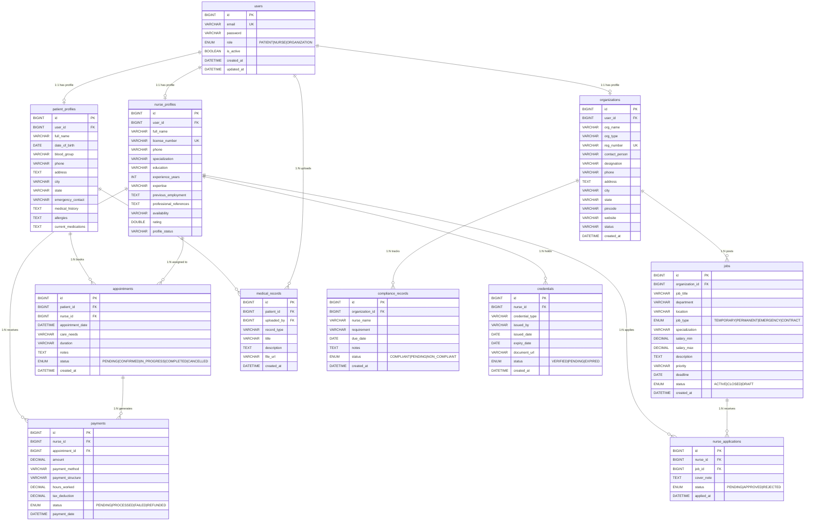

# CareConnect — Database Design Document

| | |
|---|---|
| **Project** | CareConnect — Professional Nurse Hiring & Healthcare Staffing Platform |
| **Document Type** | Database Design Document |
| **Database** | MySQL 8.0 |
| **Prepared By** | Prakhar |
| **Version** | 1.0 |
| **Date** | April 2026 |

---

## Table of Contents

1. [Project Overview](#1-project-overview)
2. [Technology Stack](#2-technology-stack)
3. [Database Design Goals](#3-database-design-goals)
4. [Entity Relationship Diagram](#4-entity-relationship-diagram)
5. [Table Descriptions](#5-table-descriptions)
6. [Relationships & Cardinality](#6-relationships--cardinality)
7. [Indexes & Performance](#7-indexes--performance)
8. [Design Decisions](#8-design-decisions)
9. [Enumerations](#9-enumerations)

---

## 1. Project Overview

CareConnect is a comprehensive healthcare staffing platform that connects three types of users:

| User Type | Description |
|---|---|
| **Patient** | Individuals requiring home healthcare or medical assistance |
| **Nurse** | Certified healthcare professionals seeking employment opportunities |
| **Organization** | Hospitals, clinics, nursing homes, and care centers that post jobs and manage staff |

The platform enables:
- Patients to book nurses for home visits and manage medical records
- Nurses to browse job listings, apply for positions, manage credentials and receive payments
- Organizations to post jobs, review applications, track compliance and manage credentialing

---

## 2. Technology Stack

| Component | Technology |
|---|---|
| Backend Framework | Spring Boot 3.2.3 |
| ORM | Spring Data JPA / Hibernate |
| Database | MySQL 8.0 |
| Security | Spring Security + JWT |
| Build Tool | Maven 3.9.6 |
| Java Version | Java 17+ |

---

## 3. Database Design Goals

1. **Role Separation** — A single `users` table handles authentication for all three roles. Each role has its own profile table (patient_profiles, nurse_profiles, organizations) linked via a 1:1 relationship. This avoids null columns and keeps the auth table clean.

2. **Data Integrity** — Foreign key constraints with appropriate CASCADE and SET NULL rules ensure referential integrity across all 11 tables.

3. **No Redundancy** — Common fields (email, password, role) are stored only in `users`. Role-specific fields live in their respective profile tables.

4. **Scalability** — Strategic indexes on frequently queried columns (status, foreign keys, expiry dates) ensure query performance as data grows.

5. **Audit Trail** — All major tables include `created_at` and where applicable `updated_at` timestamps for auditability.

---

## 4. Entity Relationship Diagram

> Open this file in VS Code with **Markdown Preview Mermaid Support** extension installed, or paste the diagram block at [mermaid.live](https://mermaid.live) to view it visually.

---

## 5. Table Descriptions

### 5.1 `users`
**Purpose:** Central authentication table shared by all three user roles. Stores only login credentials and role information. Profile data is stored in separate tables.

| Column | Type | Constraint | Description |
|---|---|---|---|
| `id` | BIGINT | PK, AUTO_INCREMENT | Unique user identifier |
| `email` | VARCHAR(255) | UNIQUE, NOT NULL | Login email (unique across all roles) |
| `password` | VARCHAR(255) | NOT NULL | BCrypt-hashed password |
| `role` | ENUM | NOT NULL | PATIENT / NURSE / ORGANIZATION |
| `is_active` | BOOLEAN | DEFAULT TRUE | Account active/suspended flag |
| `created_at` | DATETIME | AUTO | Account creation timestamp |
| `updated_at` | DATETIME | AUTO | Last update timestamp |

---

### 5.2 `patient_profiles`
**Purpose:** Stores personal, health, and emergency contact information for patients. Linked 1:1 with the `users` table.

| Column | Type | Constraint | Description |
|---|---|---|---|
| `id` | BIGINT | PK | Profile identifier |
| `user_id` | BIGINT | FK → users, UNIQUE | Links to auth record |
| `full_name` | VARCHAR(255) | NOT NULL | Patient full name |
| `date_of_birth` | DATE | | Date of birth |
| `blood_group` | VARCHAR(10) | | Blood group (A+, O-, etc.) |
| `phone` | VARCHAR(20) | | Contact phone |
| `address` | TEXT | | Home address |
| `city` | VARCHAR(100) | | City |
| `state` | VARCHAR(100) | | State |
| `emergency_contact` | VARCHAR(255) | | Emergency contact name |
| `emergency_contact_phone` | VARCHAR(20) | | Emergency contact phone |
| `medical_history` | TEXT | | Previous conditions / surgeries |
| `allergies` | TEXT | | Known allergies |
| `current_medications` | TEXT | | Active medications |

---

### 5.3 `nurse_profiles`
**Purpose:** Stores professional details of nurses including licensing, specialization, and availability.

| Column | Type | Constraint | Description |
|---|---|---|---|
| `id` | BIGINT | PK | Profile identifier |
| `user_id` | BIGINT | FK → users, UNIQUE | Links to auth record |
| `full_name` | VARCHAR(255) | NOT NULL | Nurse full name |
| `license_number` | VARCHAR(255) | UNIQUE | Nursing license / registration number |
| `phone` | VARCHAR(20) | | Contact phone |
| `specialization` | VARCHAR(255) | | Primary specialization (ICU, Pediatric, etc.) |
| `education` | VARCHAR(255) | | Educational qualification |
| `experience_years` | INT | | Years of experience |
| `expertise` | VARCHAR(1000) | | Comma-separated areas of expertise |
| `previous_employment` | TEXT | | Work history |
| `professional_references` | TEXT | | References from previous employers |
| `availability` | VARCHAR(100) | | Full-Time / Part-Time / On-Call |
| `rating` | DOUBLE | | Average rating (1.0 – 5.0) |
| `profile_status` | VARCHAR(100) | | Active / Under Review / Suspended |

---

### 5.4 `organizations`
**Purpose:** Stores details of healthcare facilities (hospitals, clinics, nursing homes) that post jobs and manage staff.

| Column | Type | Constraint | Description |
|---|---|---|---|
| `id` | BIGINT | PK | Organization identifier |
| `user_id` | BIGINT | FK → users, UNIQUE | Links to auth record |
| `org_name` | VARCHAR(255) | NOT NULL | Official organization name |
| `org_type` | VARCHAR(100) | | Hospital / Clinic / Nursing Home / etc. |
| `reg_number` | VARCHAR(255) | UNIQUE | Government registration number |
| `contact_person` | VARCHAR(255) | | Primary contact person name |
| `designation` | VARCHAR(255) | | Contact person's job title |
| `phone` | VARCHAR(20) | | Primary phone |
| `address` | TEXT | | Registered address |
| `city` | VARCHAR(100) | | City |
| `state` | VARCHAR(100) | | State |
| `pincode` | VARCHAR(10) | | Postal code |
| `website` | VARCHAR(255) | | Official website URL |
| `status` | VARCHAR(50) | DEFAULT 'ACTIVE' | Account status |
| `created_at` | DATETIME | AUTO | Registration timestamp |

---

### 5.5 `jobs`
**Purpose:** Job listings posted by organizations. Nurses browse and apply for these.

| Column | Type | Constraint | Description |
|---|---|---|---|
| `id` | BIGINT | PK | Job identifier |
| `organization_id` | BIGINT | FK → organizations | Posting organization |
| `job_title` | VARCHAR(255) | NOT NULL | Job title |
| `department` | VARCHAR(255) | | Hospital department |
| `location` | VARCHAR(255) | | Job location / city |
| `job_type` | ENUM | | TEMPORARY / PERMANENT / EMERGENCY / CONTRACT |
| `specialization` | VARCHAR(255) | | Required nurse specialization |
| `salary_min` | DECIMAL(10,2) | | Minimum salary offered |
| `salary_max` | DECIMAL(10,2) | | Maximum salary offered |
| `shift_details` | VARCHAR(255) | | Shift timing details |
| `patient_acuity` | VARCHAR(255) | | Patient care complexity level |
| `description` | TEXT | | Full job description |
| `priority` | VARCHAR(50) | DEFAULT 'Normal' | Normal / High / Urgent |
| `deadline` | DATE | | Application deadline |
| `status` | ENUM | DEFAULT 'ACTIVE' | ACTIVE / CLOSED / DRAFT |
| `created_at` | DATETIME | AUTO | Posting timestamp |

---

### 5.6 `appointments`
**Purpose:** Records appointments booked by patients. A nurse may be assigned immediately or matched later.

| Column | Type | Constraint | Description |
|---|---|---|---|
| `id` | BIGINT | PK | Appointment identifier |
| `patient_id` | BIGINT | FK → patient_profiles | Requesting patient |
| `nurse_id` | BIGINT | FK → nurse_profiles, NULLABLE | Assigned nurse (set after matching) |
| `appointment_date` | DATETIME | NOT NULL | Scheduled start date and time |
| `end_date` | DATETIME | | Scheduled end date and time |
| `care_needs` | VARCHAR(255) | | Type of care required |
| `required_skills` | VARCHAR(255) | | Specific nursing skills needed |
| `duration` | VARCHAR(100) | | Estimated duration (e.g. "2 hours") |
| `notes` | TEXT | | Additional patient notes |
| `status` | ENUM | DEFAULT 'PENDING' | PENDING / CONFIRMED / IN_PROGRESS / COMPLETED / CANCELLED |
| `created_at` | DATETIME | AUTO | Booking timestamp |

---

### 5.7 `medical_records`
**Purpose:** Stores uploaded health documents for patients. Can be uploaded by the patient or an authorized nurse.

| Column | Type | Constraint | Description |
|---|---|---|---|
| `id` | BIGINT | PK | Record identifier |
| `patient_id` | BIGINT | FK → patient_profiles | Owner patient |
| `uploaded_by` | BIGINT | FK → users, NULLABLE | Uploader (patient or nurse) |
| `record_type` | VARCHAR(100) | NOT NULL | Lab Report / Prescription / X-Ray / Discharge / Other |
| `title` | VARCHAR(255) | | Document title |
| `description` | TEXT | | Description or notes |
| `file_url` | VARCHAR(500) | | Stored file path or cloud URL |
| `file_name` | VARCHAR(255) | | Original file name |
| `created_at` | DATETIME | AUTO | Upload timestamp |

---

### 5.8 `nurse_applications`
**Purpose:** Tracks which nurse has applied to which job. Enforces a unique constraint to prevent duplicate applications.

| Column | Type | Constraint | Description |
|---|---|---|---|
| `id` | BIGINT | PK | Application identifier |
| `nurse_id` | BIGINT | FK → nurse_profiles | Applying nurse |
| `job_id` | BIGINT | FK → jobs | Target job |
| `cover_note` | TEXT | | Nurse's cover letter / note |
| `status` | ENUM | DEFAULT 'PENDING' | PENDING / APPROVED / REJECTED |
| `applied_at` | DATETIME | AUTO | Application submission timestamp |

> **Unique Constraint:** `(nurse_id, job_id)` — prevents a nurse from applying to the same job twice.

---

### 5.9 `compliance_records`
**Purpose:** Organizations track regulatory and policy compliance requirements for their nursing staff.

| Column | Type | Constraint | Description |
|---|---|---|---|
| `id` | BIGINT | PK | Record identifier |
| `organization_id` | BIGINT | FK → organizations | Owning organization |
| `nurse_name` | VARCHAR(255) | | Nurse this record applies to |
| `requirement` | VARCHAR(255) | | Compliance requirement description |
| `due_date` | DATE | | Deadline for compliance |
| `notes` | TEXT | | Additional notes |
| `status` | ENUM | DEFAULT 'PENDING' | COMPLIANT / PENDING / NON_COMPLIANT |
| `created_at` | DATETIME | AUTO | Record creation timestamp |

---

### 5.10 `credentials`
**Purpose:** Stores nurse professional credentials such as nursing licenses, CPR certifications, and specialty certificates. Tracks expiry dates to send renewal reminders.

| Column | Type | Constraint | Description |
|---|---|---|---|
| `id` | BIGINT | PK | Credential identifier |
| `nurse_id` | BIGINT | FK → nurse_profiles | Credential holder |
| `credential_type` | VARCHAR(255) | NOT NULL | Nursing License / BLS / ACLS / etc. |
| `issued_by` | VARCHAR(255) | | Issuing authority (e.g. Indian Nursing Council) |
| `issued_date` | DATE | | Issue date |
| `expiry_date` | DATE | | Expiry date (indexed for alert queries) |
| `document_url` | VARCHAR(500) | | Uploaded document URL |
| `status` | ENUM | DEFAULT 'PENDING' | VERIFIED / PENDING / EXPIRED |
| `created_at` | DATETIME | AUTO | Record creation timestamp |

---

### 5.11 `payments`
**Purpose:** Records payment transactions made to nurses for their services. Supports multiple payment structures and tracks tax deductions.

| Column | Type | Constraint | Description |
|---|---|---|---|
| `id` | BIGINT | PK | Payment identifier |
| `nurse_id` | BIGINT | FK → nurse_profiles | Payee nurse |
| `appointment_id` | BIGINT | FK → appointments, NULLABLE | Related appointment (if applicable) |
| `amount` | DECIMAL(10,2) | NOT NULL | Payment amount |
| `payment_method` | VARCHAR(100) | | Bank Transfer / UPI / Cheque |
| `payment_structure` | VARCHAR(100) | | Hourly / Per Diem / Salary |
| `hours_worked` | DECIMAL(5,2) | | Hours worked in this period |
| `tax_deduction` | DECIMAL(10,2) | | TDS or other deductions |
| `description` | TEXT | | Payment description / remarks |
| `status` | ENUM | DEFAULT 'PENDING' | PENDING / PROCESSED / FAILED / REFUNDED |
| `payment_date` | DATETIME | AUTO | Transaction timestamp |

---

## 6. Relationships & Cardinality

| Parent Table | Child Table | Type | Foreign Key | Notes |
|---|---|---|---|---|
| `users` | `patient_profiles` | **1 : 1** | `user_id` | Each patient has exactly one profile |
| `users` | `nurse_profiles` | **1 : 1** | `user_id` | Each nurse has exactly one profile |
| `users` | `organizations` | **1 : 1** | `user_id` | Each org admin has one org profile |
| `organizations` | `jobs` | **1 : N** | `organization_id` | An org can post many jobs |
| `organizations` | `compliance_records` | **1 : N** | `organization_id` | An org tracks many compliance items |
| `patient_profiles` | `appointments` | **1 : N** | `patient_id` | A patient books many appointments |
| `nurse_profiles` | `appointments` | **1 : N** | `nurse_id` | A nurse is assigned to many appointments |
| `patient_profiles` | `medical_records` | **1 : N** | `patient_id` | A patient owns many medical records |
| `users` | `medical_records` | **1 : N** | `uploaded_by` | A user (nurse or patient) uploads records |
| `nurse_profiles` | `nurse_applications` | **1 : N** | `nurse_id` | A nurse applies to many jobs |
| `jobs` | `nurse_applications` | **1 : N** | `job_id` | A job receives many applications |
| `nurse_profiles` | `credentials` | **1 : N** | `nurse_id` | A nurse holds many credentials |
| `nurse_profiles` | `payments` | **1 : N** | `nurse_id` | A nurse receives many payments |
| `appointments` | `payments` | **1 : N** | `appointment_id` | An appointment can generate payments |

---

## 7. Indexes & Performance

| Table | Index Name | Column(s) | Type | Purpose |
|---|---|---|---|---|
| `users` | `uq_users_email` | `email` | UNIQUE | Fast login lookup |
| `nurse_profiles` | `uq_nurse_license` | `license_number` | UNIQUE | License uniqueness check |
| `organizations` | `uq_org_reg_number` | `reg_number` | UNIQUE | Registration uniqueness check |
| `nurse_applications` | `uq_nurse_job_application` | `(nurse_id, job_id)` | UNIQUE | Prevent duplicate applications |
| `jobs` | `idx_jobs_org` | `organization_id` | INDEX | Load org's job listings |
| `jobs` | `idx_jobs_status` | `status` | INDEX | Filter active jobs |
| `appointments` | `idx_appt_patient` | `patient_id` | INDEX | Load patient appointments |
| `appointments` | `idx_appt_nurse` | `nurse_id` | INDEX | Load nurse schedule |
| `appointments` | `idx_appt_status` | `status` | INDEX | Filter by appointment status |
| `credentials` | `idx_cred_expiry` | `expiry_date` | INDEX | Query credentials expiring soon |
| `payments` | `idx_pay_nurse` | `nurse_id` | INDEX | Load nurse payment history |
| `payments` | `idx_pay_status` | `status` | INDEX | Filter pending payments |

---

## 8. Design Decisions

### 8.1 Single `users` Table for All Roles
Rather than creating three separate user tables (patients, nurses, org_admins), a single `users` table with a `role` ENUM column is used. Role-specific data is stored in dedicated profile tables. This approach:
- Simplifies authentication (one table, one email uniqueness constraint)
- Keeps the JWT token strategy consistent
- Avoids duplicate email entries across role tables

### 8.2 Nullable `nurse_id` in `appointments`
The `nurse_id` in the `appointments` table is nullable. A patient can book an appointment specifying care needs, and a nurse can be assigned later by the system or organization. This supports both direct booking and demand-based matching workflows.

### 8.3 `medical_records.uploaded_by` References `users` (not nurse_profiles)
The uploader can be a patient uploading their own documents, or a nurse uploading care documentation. By pointing to `users` directly, both scenarios are covered without creating two separate foreign key columns.

### 8.4 Unique Constraint on `nurse_applications (nurse_id, job_id)`
A composite unique constraint ensures a nurse cannot apply to the same job more than once. This is enforced at the database level, not just the application layer, preventing race conditions.

### 8.5 `ON DELETE CASCADE` vs `SET NULL`
- **CASCADE** is used where child records are meaningless without the parent (e.g., nurse_applications without a nurse, compliance_records without an org).
- **SET NULL** is used where child records retain value even without the parent (e.g., an appointment record remains meaningful for audit even if a nurse account is deleted).

### 8.6 DECIMAL for Monetary Values
All financial columns (`amount`, `salary_min`, `salary_max`, `tax_deduction`) use `DECIMAL(10,2)` instead of `FLOAT` or `DOUBLE` to avoid floating-point precision errors in financial calculations.

---

## 9. Enumerations

| Table | Column | Values |
|---|---|---|
| `users` | `role` | PATIENT, NURSE, ORGANIZATION |
| `jobs` | `job_type` | TEMPORARY, PERMANENT, EMERGENCY, CONTRACT |
| `jobs` | `status` | ACTIVE, CLOSED, DRAFT |
| `appointments` | `status` | PENDING, CONFIRMED, IN_PROGRESS, COMPLETED, CANCELLED |
| `nurse_applications` | `status` | PENDING, APPROVED, REJECTED |
| `compliance_records` | `status` | COMPLIANT, PENDING, NON_COMPLIANT |
| `credentials` | `status` | VERIFIED, PENDING, EXPIRED |
| `payments` | `status` | PENDING, PROCESSED, FAILED, REFUNDED |

---

*Document generated for CareConnect SRS 2026 — Internship Project Submission*
