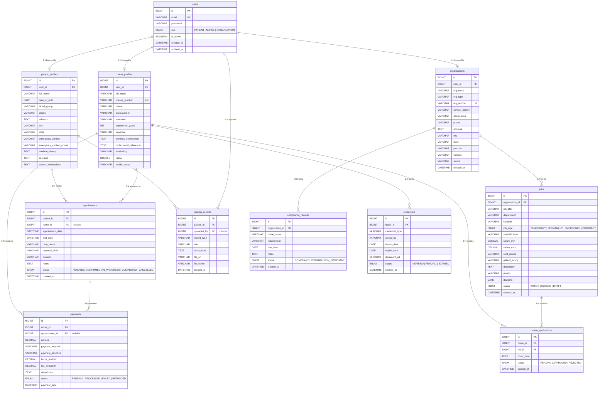

# CareConnect — Entity Relationship Diagram

> Render this file in VS Code with the **Markdown Preview Mermaid Support** extension,
> or paste the diagram block into [mermaid.live](https://mermaid.live).

---

## Relationship Reference

| Table | Related To | Type | Via Column |
|---|---|---|---|
| `patient_profiles` | `users` | 1:1 | `user_id` |
| `nurse_profiles` | `users` | 1:1 | `user_id` |
| `organizations` | `users` | 1:1 | `user_id` |
| `jobs` | `organizations` | N:1 | `organization_id` |
| `appointments` | `patient_profiles` | N:1 | `patient_id` |
| `appointments` | `nurse_profiles` | N:1 (nullable) | `nurse_id` |
| `medical_records` | `patient_profiles` | N:1 | `patient_id` |
| `medical_records` | `users` | N:1 (nullable) | `uploaded_by` |
| `nurse_applications` | `nurse_profiles` | N:1 | `nurse_id` |
| `nurse_applications` | `jobs` | N:1 | `job_id` |
| `compliance_records` | `organizations` | N:1 | `organization_id` |
| `credentials` | `nurse_profiles` | N:1 | `nurse_id` |
| `payments` | `nurse_profiles` | N:1 | `nurse_id` |
| `payments` | `appointments` | N:1 (nullable) | `appointment_id` |

## Indexes Summary

| Table | Index | Purpose |
|---|---|---|
| `users` | `uq_users_email` | Fast login lookup |
| `nurse_profiles` | `uq_nurse_license` | License number uniqueness |
| `organizations` | `uq_org_reg_number` | Registration number uniqueness |
| `nurse_applications` | `uq_nurse_job_application` | Prevent duplicate applications |
| `jobs` | `idx_jobs_status` | Filter active jobs quickly |
| `appointments` | `idx_appt_status` | Filter by appointment status |
| `credentials` | `idx_cred_expiry` | Query expiring credentials |
| `payments` | `idx_pay_status` | Filter pending/processed payments |
